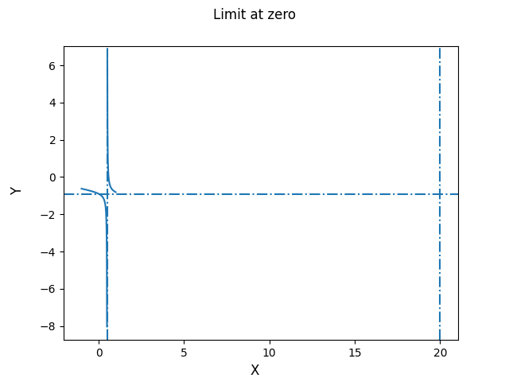
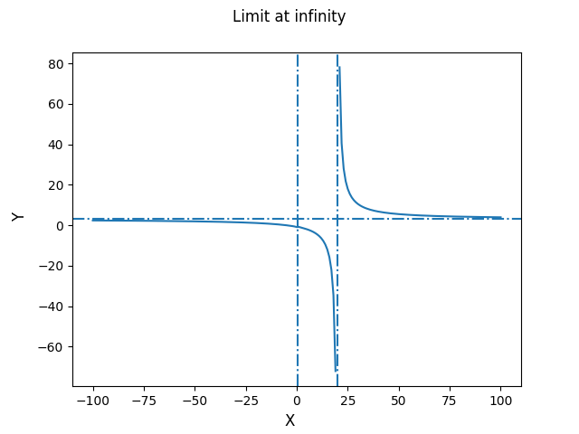

# limfunrat2
The file `limfunrat2.py` contains the code to calculate and visualize the limits of a quadratic rational function as x approaches infinity and zero. To use this code for the following rational function: `(3x^2+13.7x-9)/(x^2-20.5x+10)`, you need to enter the following command: `lim(3, 13.7, -9, 1, -20.5, 10)`. The program will display two images, one for the limit at infinity and the other for the limit at zero.

Once the images are displayed, the program prints the limits and roots: `((-0.9, -0.9, [20.0, 0.5]), (3.0, 3.0, [20.0, 0.5]))`.